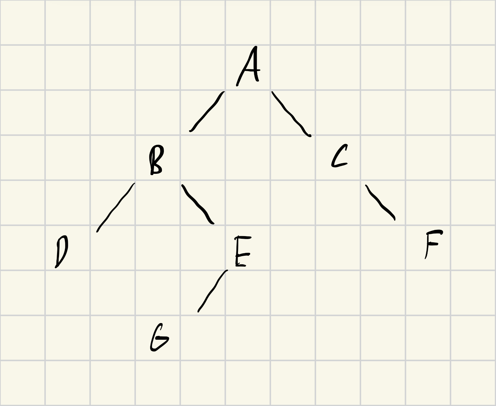

# Activity 10 Graphs

## Questions
### Question 1
This photo illistrates a theoretical graph.
<p align="center">

</p>

### Question 2
This is the code to make this theoretical graph.
```c++
#include <iostream>
#include <list>
#include <queue>
using namespace std;

class Graph{
    int V;
    list<int>* adj;

public:
    Graph(int V){
        this->V = V;
        adj = new list<int>[V];
    }

    void addEdge(int v, int w){
        adj[v].push_back(w);
        adj[w].push_back(v);
    }

    void BFS(int start){
        bool* visited = new bool[V];
        for(int i=0; i<V; i++)
            visited[i] = false;

        queue<int> q;
        visited[start] = true;
        q.push(start);

        cout << "BFS Traversal: ";

        while(!(q.empty())){
            int v = q.front();
            cout << v << " ";
            q.pop();

            for(auto i : adj[v]){
                if(!(visited[i])){
                    visited[i] = true;
                    q.push(i);
                }
            }
        }
        cout << endl;
    }

    void DFSUtil(int v, bool visited[]){
        visited[v] = true;
        cout << v << " ";

        for(auto i : adj[v]){
            if(!(visited[i]))
                DFSUtil(i, visited);
        }
    }

    void DFS(int start){
        bool* visited = new bool[V];
        for(int i=0; i<V; i++)
            visited[i] = false;

        cout << "DFS Traversal: ";
        DFSUtil(start, visited);
        cout << endl;
    }
};

int main(){
    Graph g(7);

    //A=0, B=1, C=2, D=3, E=4, F=5, G=6
    g.addEdge(0, 1); //A-B
    g.addEdge(0, 2); //A-C
    g.addEdge(1, 3); //B-D
    g.addEdge(1, 4); //B-E
    g.addEdge(2, 5); //C-F
    g.addEdge(4, 6); //E-G

    //Print
    g.BFS(0);
    g.DFS(0);

    //Return 0 success
    return 0;
}
```

### Question 3
Both search algorithms have the same context of Big O notations.
They are $O(V+E)$ where $V$ is the vertices and $E$ is the edges since they both visit each vertex and edge once in the worst case scenario.
They differ on how the traverse the graph.
BFS uses a queue to traverse nodes level by level.
DFS uses recursion or a stack to explore as far as possible along one branch before backtracking.
