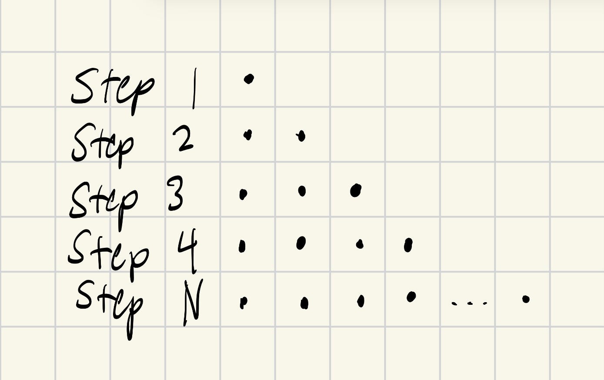
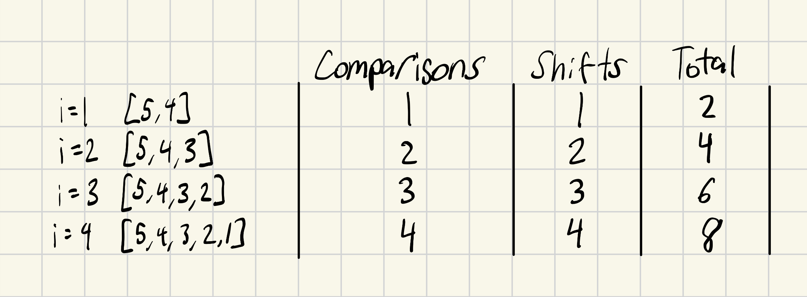

# Activity 4a Sorting II


## Questions
1. Each step there is a comparison. At step 1, there is no comparison. The total work will be N-1 with each step being more work than the last with quadratic growth.
<p align="center">

</p>

2a. If you add up all the comparisons and shifts, you get a total operations of 20. 
<p align="center">

</p>

2b. At i=2, the total operations is 18. At i=3, the total operations is 14.

2c. No, because insertion will not sort the elements before 'i' like i=1.

3a. The time complexity would be O(N) because the for loop goes through the string length.
```
function containsX(string) {
	foundX = false;
	for(let i = 0; i < string.length; i++) { 
		if (string[i] === "X") {
			foundX = true; 
		}
	}
	return foundX; 
}
```

3b. This code is faster because it will return true once found 'X' inside of the string length compared to the code in 3a which runs the whole string length no matter if it found 'X' already or not.
```
function containsX(string){
    for(let i=0; i<string.length; i++){
        if(string[i] === "X")
            return true;
    }
    return false;
}
```
