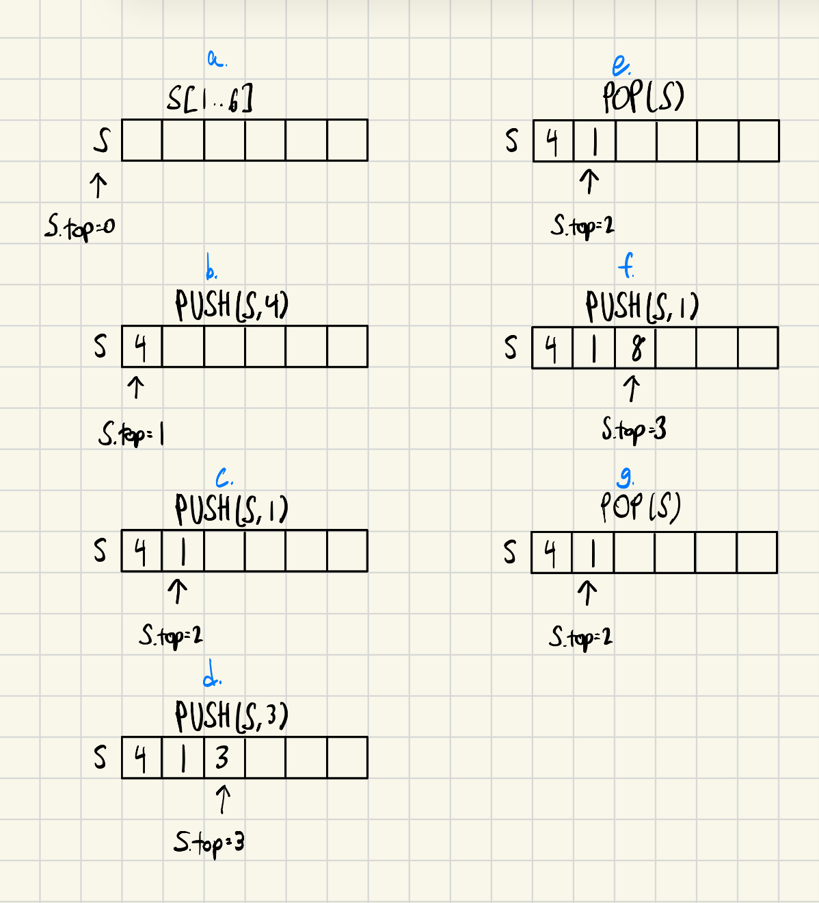
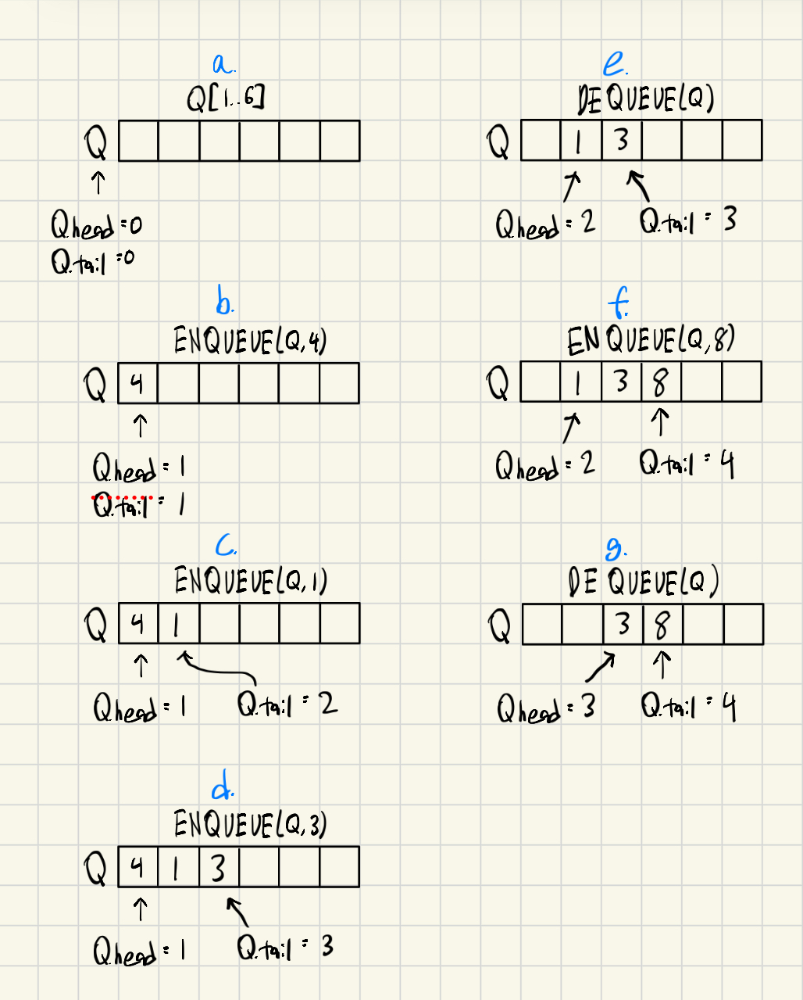

# Activity 6 Stacks and Queues

## Questions
### Question 1
This photo illustrates each operation in the sequence for the empty statck $S$ stored in the array $S[1..6]$.
<p align="center">

</p>

### Question 2
This photo illustrates each operation in the sequence for the empty queue $Q$ stored in the array $Q[1..6]$.
<p align="center">

</p>

### Question 3
Rewritten ENQUEUE($Q, x$) - Overflow
```
if Q.head == Q.tail + 1 OR (Q.head == 1 AND Q.tail == Q.length)
    error "overflow"
else
    Q[Q.tail] = x
    if Q.tail == Q.length
        Q.tail = 1
    else
        Q.tail = Q.tail + 1
```

Rewritten DEQUEUE($Q$) - Underflow
```
if Q.head == Q.tail
    error "underflow"
else
    x = Q[Q.head]
    if Q.head == Q.length
        Q.head = 1
    else
        Q.head = Q.head + 1
    return x
```

### Question 4
INSERT($D, x$) - Beginning end
```
if (D.head == 1 AND D.tail == D.length) OR (D.head == D.tail + 1)
    error "overflow"
if D.head == 1
    D.head = D.length
else
    D.head = D.head - 1
D[D.head] = x
```

INSERT($D, x$) - Back end
```
if (D.head == 1 AND D.tail == D.length) OR (D.head == D.tail + 1)
    error "overflow"
D[D.tail] = x
if D.tail == D.length
    D.tail = 1
else
    D.tail = D.tail + 1
```

DELETE($D$) - Beginning end
```
if D.head == D.tail
    error "underflow"
x = D[D.head]
if D.head == D.length
    D.head = 1
else
    D.head = D.head + 1
return x
```

DELETE($D$) - Back end
```
if D.head == D.tail
    error "underflow"
if D.tail == 1
    D.tail = D.length
else
    D.tail = D.tail - 1
x = D[D.tail]
return x
```
