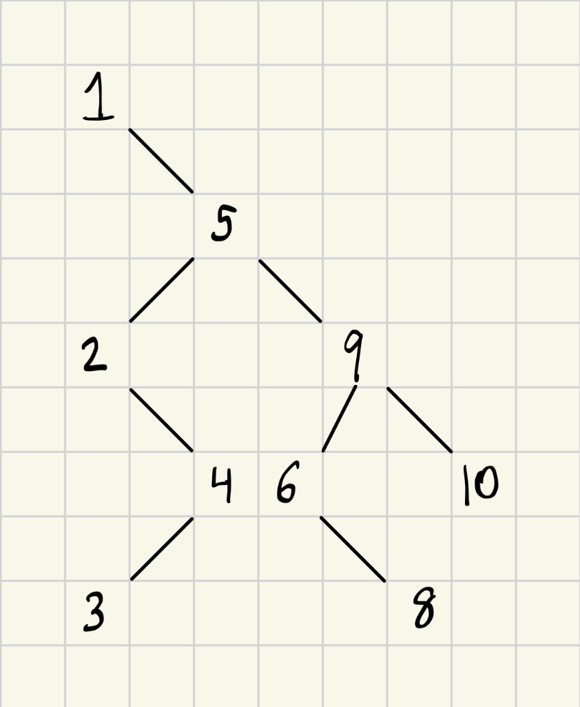

# Activity 8 Binary search trees

## Questions
### Question 1
This photo illistrates the insertion of $[1, 5, 9, 2, 4, 10, 6, 3, 8]$ in order into an empty binary search tree.
<p align="center">

</p>

### Question 2
A well-balanced binary search tree's time complexity is $O(log N)$ so if it's $1000$ values, $log(1000) = 9.96$ so the maximum number of steps is $10$. 

### Question 3
We know that the greatest value within a binary search tree is the farthest right node.
We can then write this function searching the root.
```
function findMax(root){
    if(root == null)
        return null

    current = root
    
    while(current.right != null)
        current = current.right

    return current
}
```
### Question 4
Output
```
Binary Search Tree: 1 5 2 4 3 9 6 8 10
Process finished with exit code 0
```

Code
```c++
#include <iostream>
using namespace std;

struct Node{
    int data;
    Node* left;
    Node* right;

    Node(int value){
        data = value;
        left = right = nullptr;
    }
};

Node* insert(Node* root, int element){
    if(root == nullptr)
        return new Node(element);

    if(element < root->data)
        root->left = insert(root->left, element);
    else
        root->right = insert(root->right, element);

    return root;
}

void printTree(const Node* root){
    if(root == nullptr)
        return;

    cout << root->data << " ";
    printTree(root->left);
    printTree(root->right);
}

int main(){
    int array[] = {1, 5, 9, 2, 4, 10, 6, 3, 8};
    Node* root = nullptr;
    int elementSize = size(array);

    //Inserts each element in order to build tree
    for(int i=0; i<elementSize; i++)
        root = insert(root, array[i]);

    //Print
    cout << "Binary Search Tree: ";
    printTree(root);

    //Return 0 success
    return 0;
}
```
