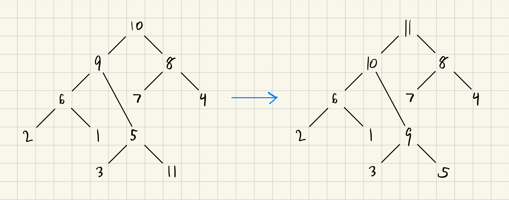
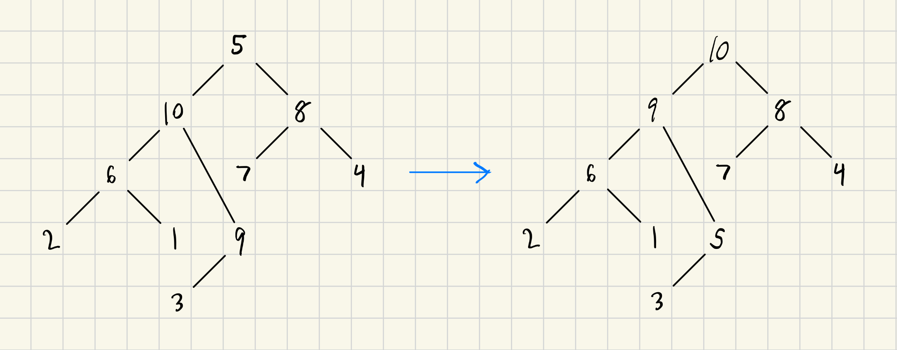

# Activity 9 Binary heaps

## Questions
### Question 1
This photo illistrates the insertion of the value 11 at the next open position to maintain the complete binary tree.
It is then repeatedly swapped with its parent node until the max-heap property is made.

### Question 2
This photo illistrates the deletion of the root.
After deletion replaces the root with the last element $(5)$.
The last element then repeatedly swaps with the larger child until the heap is maintained.
This also goes back to the origin heap as $11$ was inserted into it in Question 1 and since it was the root, everything goes back into place.

### Question 3
After inserting the numbers: $55, 22, 34, 10, 2, 99, 68$ into a new heap in this order, it will then swap until max-heap property.
When this is complete, you pop from the heap.
This will pop the root node and then place each number into a new array: $[99, 68, 55, 34, 22, 10, 2]$.
